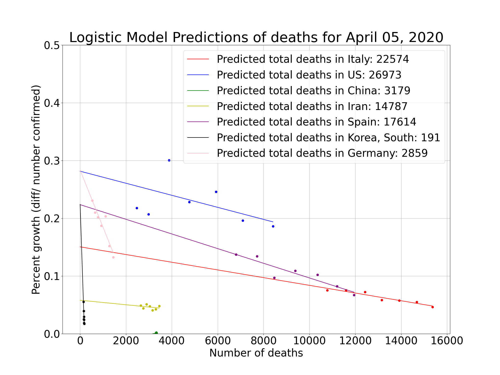
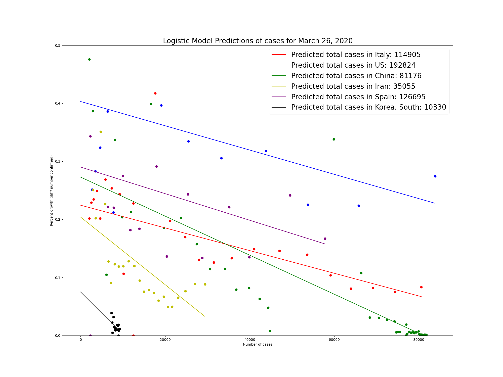

## Logistic Regression Modeling For Covid
This is a simple way of predicting the total number of deaths or cases by assuming that the growth in these numbers will follow a logistic growth curve.

Virtually every major epidemic has resulted in growth curves that look like this (even in some cases where there is under-testing), and every country has been roughly following this pattern so far.

These results will be updated at midnight pacific time every day, and with more data, the model should improve.

One simple way to fit this model is to plot the number on the x axis and the percent growth from the previous point on the y axis. For a perfect logistic curve this relationship will be linear. So then I fit a line to the resulting points and project out to where the growth rate eventually falls to 0, indicating the total number has plateaued. I take that number as the prediction. 

This model is not likely to work well when the total number is still small, so  am focusing on countries that have reported more than 100 deaths.

For a good primer on Logistic Growth, see this great [video by 3Blue1Brown](https://www.youtube.com/watch?v=Kas0tIxDvrg)

I will be updating this data daily using the code in this Github repo.
Caveats:
1. There is likely to be a second increase in cases after the summer.
2. If there is a huge change in policy or approach to managing the pandemic (people stop social distancing), then the model will most likely underpredict massively. Predictions from this model should never be used to justify ceasing effective preventative measures like social distancing.
3. If there is a huge surge in testing, the model will probably get confused for a few days and then eventually recover.

